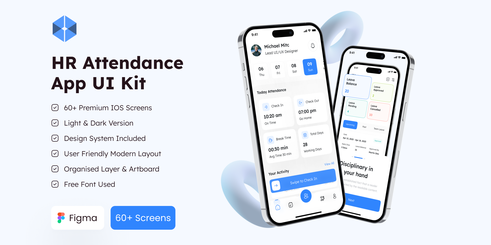

# HR Attendance



Đây là một ứng dụng xây dựng theo giao diện từ figma

## Modify App

Sửa file index.js, và styles.js của thư viện react-native-raw-bottom-sheet:

```
<BlurViewAnimated
    blurType={'light'}
    onTouchStart={() => (closeOnPressMask ? this.close() : null)}
    style={[
        StyleSheet.absoluteFillObject,
        {
            opacity: animatedHeight.interpolate({inputRange: [0, height], outputRange: [0, 1], extrapolate: 'clamp'})
        }
    ]}
/>
```

```
wrapper: {
    backgroundColor: "#00000077",
    flex: 1,
    justifyContent: 'flex-end',
}
```

## NPM Scripts

* 🔥 `start` - run development server
* 🙏 `android` - run project for android
* 🙏 `ios` - run project for ios